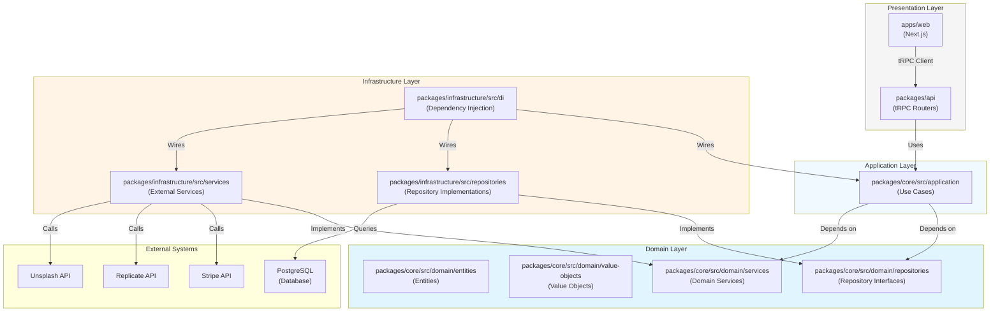

# Canvastra Next.js - Hexagonal DDD Architecture

This document describes the hexagonal domain-driven design (DDD) architecture implemented in this project.

## Architecture Overview

The project follows clean hexagonal architecture with clear separation of concerns:



## Package Structure

### `packages/core` - Domain & Application  Layers
Pure business logic with zero framework dependencies.

**Domain Layer** (`src/domain/`)
- **Entities**: Business objects with identity and business rules
  - `User`, `Project`, `Subscription`
  - Each entity has business logic methods (e.g., `Project.updateJson()`)
- **Value Objects**: Immutable objects representing concepts
  - `Email`, `ProjectDimensions`
  - Include validation logic
- **Repository Interfaces**: Contracts for data access
  - `UserRepository`, `ProjectRepository`, `SubscriptionRepository`
  - Define methods without implementation details

**Application Layer** (`src/application/`)
- **Use Cases**: Application-specific business operations
  - `CreateProjectUseCase`, `GetProjectsUseCase`, etc.
  - Orchestrate domain objects to fulfill requirements
  - Depend on repository interfaces (DI pattern)

### `packages/infrastructure` - Infrastructure Layer
Implements external concerns and bridges to domain.

- **Repositories** (`src/repositories/`)
  - `DrizzleProjectRepository` implements `ProjectRepository`
  - Maps between database rows and domain entities
  - Uses Drizzle ORM for database access

- **Dependency Injection** (`src/di/`)
  - `container.ts` wires up repositories and use cases
  - Single source of truth for dependencies
  - Makes testing easier (can swap implementations)

### `packages/db` - Database Schema
Database definitions and client configuration.

- **Schema** (`src/schema/`)
  - `auth.ts` - Authentication tables (better-auth)
  - `canvastra.ts` - Application tables (projects, subscriptions)
  - Drizzle ORM schema definitions

- **Client** (`src/index.ts`)
  - Neon PostgreSQL connection
  - Configured for edge runtimes

### `packages/api` - API Layer (tRPC)
Type-safe API routes using tRPC.

- **Routers** (`src/routers/`)
  - `project.router.ts` - Project CRUD operations
  - Uses DI container to access use cases
  - Validates input with Zod schemas

### `apps/web` - Next.js Application
Frontend application using Next.js App Router.

- Will consume tRPC API for type-safe client
- Server Components and Client Components
- Authentication with better-auth

## Data Flow Example

### Creating a Project

1. **API Route** (`packages/api/src/routers/project.router.ts`)
   ```typescript
   create: publicProcedure
     .input(schema)
     .mutation(async ({ input }) => {
       return await container.useCases.project.create.execute(input);
     })
   ```

2. **Use Case** (`packages/core/src/application/use-cases/project/create-project.use-case.ts`)
   ```typescript
   async execute(request) {
     const project = await this.projectRepository.create({
       name: request.name,
       userId: request.userId,
       // ...
     });
     return { project };
   }
   ```

3. **Repository** (`packages/infrastructure/src/repositories/drizzle-project.repository.ts`)
   ```typescript
   async create(data) {
     const result = await db.insert(projectTable).values(data).returning();
     return this.mapToEntity(result[0]);
   }
   ```

4. **Domain Entity** (`packages/core/src/domain/entities/project.entity.ts`)
   ```typescript
   class Project extends BaseEntity {
     // Business logic
     public updateJson(json: string): Project {
       return new Project({ ...this, json, updatedAt: new Date() });
     }
   }
   ```

## Key Principles

1. **Dependency Inversion**: Domain doesn't depend on infrastructure
   - Domain defines interfaces, infrastructure implements them
   - Use cases depend on repository interfaces, not implementations

2. **Separation of Concerns**: Each layer has distinct responsibility
   - Domain: Business rules and entities
   - Application: Use case orchestration
   - Infrastructure: External concerns (DB, APIs)
   - Presentation: User interface

3. **Immutability**: Entities use immutable updates
   - Methods return new instances rather than mutating
   - Ensures predictable behavior

4. **Testability**: Pure business logic is easy to test
   - Use cases can be tested with mocked repositories
   - Domain entities have no external dependencies

## Benefits

- **Maintainability**: Clear boundaries make changes easier
- **Testability**: Business logic isolated from infrastructure
- **Flexibility**: Easy to swap implementations (e.g., different database)
- **Scalability**: Architecture supports growing complexity
- **Type Safety**: Full TypeScript coverage end-to-end

## Implementation Status

✅ **Complete** - All features have been migrated to clean architecture:

- **Repositories**: Project, User, Subscription
- **Use Cases**: All CRUD operations for Projects, Users, Subscriptions, AI, Images
- **Domain Services**: BillingService, AIService, ImageService
- **tRPC Routers**: Project, Subscription, AI, Images
- **Frontend**: All API hooks migrated to tRPC

## Extending the Architecture

To add new features:

1. Add new entities to `packages/core/src/domain/entities/`
2. Define repository interface in `packages/core/src/domain/repositories/`
3. Create use cases in `packages/core/src/application/use-cases/`
4. Implement repository in `packages/infrastructure/src/repositories/`
5. Register in DI container `packages/infrastructure/src/di/container.ts`
6. Create tRPC router in `packages/api/src/routers/`
7. Consume from Next.js app in `apps/web/` using tRPC client

## Architecture Compliance

This repository follows clean architecture principles:

- ✅ **Dependency Rule**: Dependencies point inward (Domain ← Application ← Infrastructure ← API ← UI)
- ✅ **Framework Independence**: Core package has zero framework dependencies
- ✅ **Testability**: Business logic can be tested without external dependencies
- ✅ **Separation of Concerns**: Each layer has distinct responsibilities
- ✅ **Single Responsibility**: Each use case handles one business operation
